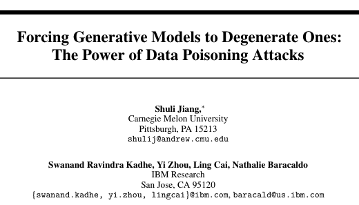

# PoisonedRAG: Knowledge Poisoning Attacks to Retrieval-Augmented Generation of Large Language Models

<figure><figcaption></figcaption></figure>

## 阅读总结报告

### 1. 研究背景

大型语言模型（LLMs）因其卓越的生成能力而取得显著成功。然而，LLMs存在固有的局限性，例如缺乏最新知识和幻觉行为。为了缓解这些限制，提出了检索增强生成（Retrieval-Augmented Generation, RAG）技术，它通过从知识数据库中检索相关知识来增强LLM的输入。尽管现有研究主要关注提高RAG的准确性或效率，但其安全性大多未被探索。

### 2. 过去方案和缺点

以往的研究主要集中在改进RAG的准确性或效率上，例如设计新的检索器以检索更相关的知识，或提出各种技术以提高从知识数据库中检索知识的效率。然而，这些研究没有充分考虑RAG的安全性，特别是对抗性攻击的可能性。

### 3. 本文方案和步骤

本文提出了PoisonedRAG，一种针对RAG的知识投毒攻击。攻击者可以在知识数据库中注入少量被污染的文本，使得LLM为攻击者选择的目标问题生成攻击者选择的目标答案。作者将知识投毒攻击形式化为一个优化问题，并提出了两种解决方案，分别针对攻击者对RAG的背景知识（例如黑盒和白盒设置）。

<figure><figcaption></figcaption></figure>

### 4. 本文创新点与贡献

* 提出了PoisonedRAG，这是一套针对RAG的知识投毒攻击。
* 将知识投毒攻击形式化为优化问题，并设计了两种有效的解决方案。
* 在多个基准数据集和LLMs上进行了广泛的评估，证明了PoisonedRAG的有效性。
* 探索了几种防御措施，并发现它们不足以防御PoisonedRAG，强调了开发新防御措施的需求。

### 5. 本文实验

实验结果表明，PoisonedRAG在黑盒和白盒设置下都能实现高达90%的攻击成功率。此外，作者还评估了最近提出的防御措施，发现它们不足以防御PoisonedRAG。

### 6. 实验结论

PoisonedRAG展示了RAG在面对知识投毒攻击时的脆弱性。即使是在注入少量被污染文本的情况下，攻击者也能有效地操纵LLM生成特定的答案。这强调了在实际应用中需要考虑RAG的安全性。

### 7. 全文结论

本文的研究揭示了RAG技术的安全性漏洞，并提出了一种新的攻击方法PoisonedRAG。实验结果表明，现有的防御措施无法有效抵御这种攻击，这为未来在RAG安全性方面的研究提供了新的方向。

### 阅读总结

PoisonedRAG的研究为理解LLMs在实际应用中的潜在风险提供了新的视角。通过揭示RAG的安全性漏洞，本文不仅提出了一种新的攻击方法，还强调了开发新的防御策略的重要性。这对于确保LLMs在关键领域（如医疗、金融和法律咨询）的安全部署具有重要意义。
