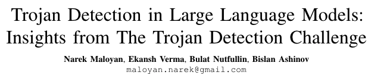

# LANGUAGE MODELS ARE HOMER SIMPSON! Safety Re-Alignment of Fine-tuned Language Models through Task Ar

<figure><figcaption></figcaption></figure>

## 研究背景

随着大型语言模型（LLMs）在各种任务中表现出色，它们的安全性问题也日益受到关注。尤其是在微调（fine-tuning）过程中，LLMs往往会牺牲安全性以提高特定任务的性能，这可能导致模型产生有害的输出。因此，如何在提高模型性能的同时保证其安全性，成为了一个亟待解决的问题。

## 过去方案和缺点

以往的研究主要集中在通过微调来提高LLMs在特定任务上的性能，但这往往会损害模型的安全性。一些研究尝试通过增加额外的对齐步骤来提高安全性，但这通常需要额外的计算成本和时间。此外，即使在使用看似无害的数据集进行微调时，也可能出现安全性问题，这说明了微调过程本身可能就存在安全隐患。

<figure><figcaption></figcaption></figure>

## 本文方案和步骤

本文提出了一种名为RESTA（REstoring Safety through Task Arithmetic）的方法，通过简单的算术运算来恢复微调后模型的安全性。RESTA的核心思想是在微调模型的权重上加上一个安全向量（safety vector），以此来抵消微调过程中引入的不安全因素。此外，文章还引入了Drop and REscale (DARE) 技术来减少微调过程中产生的冗余参数，从而提高RESTA的效果。

## 本文创新点与贡献

RESTA方法的创新之处在于它提供了一种简单、快速且有效的方式来恢复微调后模型的安全性，而不需要额外的对齐成本。此外，RESTA不仅适用于参数高效的微调（PEFT），也适用于全参数微调（Full-FT），并且可以广泛应用于多种下游任务和语言。文章还提出了一个新的多语言安全评估基准数据集CATQA，用于全面评估模型的安全性。

## 本文实验

实验部分，作者在多种下游任务上测试了RESTA的效果，包括中文、英文和印地语的指令遵循，以及代码和数学问题解决能力。同时，作者还在三个现有的安全评估基准和新提出的CATQA数据集上测试了RESTA的泛化能力。

## 实验结论

实验结果表明，RESTA能显著降低微调模型的有害性，从18.6%降至5.1%（参数高效微调）和从9.2%降至1.5%（全参数微调），同时保持了模型在任务上的大部分性能。在多语言CATQA评估中，RESTA也显示出了良好的效果。

## 全文结论

RESTA提供了一种有效的解决方案来应对微调语言模型中的安全性问题。通过简单的算术运算添加安全向量，RESTA能够在不同任务和语言中恢复模型的安全性，同时最小化对模型性能的影响。此外，通过引入新的评估基准CATQA，本文为未来的研究提供了宝贵的资源。

注：

在微调后的模型权重上添加安全向量，是指在大型语言模型（LLMs）经过特定任务的微调（fine-tuning）之后，针对模型的参数进行调整，以增强其安全性的一种方法。这里的“安全向量”（safety vector）是一个数学概念，它代表了从安全对齐的模型（即未经微调的原始模型）到微调后的模型之间参数变化的差值。

具体来说，微调是调整预训练模型的参数，使其在特定任务上表现得更好。然而，这个过程中可能会导致模型生成一些不安全或有害的输出。为了解决这个问题，研究者们提出了RESTA方法，它通过计算安全对齐模型和微调后模型之间的差异（即安全向量），然后将这个向量加到微调后的模型参数上，以此来减少或消除微调过程中引入的不安全因素。

这种方法的核心思想是，通过这种算术加法操作，可以将模型的一些不安全行为“抵消”掉，从而恢复到一个更加安全的状态。这样做的好处是，它不需要重新对模型进行大规模的训练，也不需要复杂的对齐过程，而是通过简单的参数调整来实现安全性的提升。

## 阅读总结报告

本篇论文提出了RESTA方法，旨在解决大型语言模型在微调过程中可能出现的安全性问题。通过在微调后的模型权重上添加安全向量，RESTA能够有效地恢复模型的安全性，同时保持或仅轻微影响模型在特定任务上的性能。此外，文章还引入了DARE技术来进一步优化RESTA的效果，并提出了新的多语言安全评估基准CATQA，为评估模型安全性提供了新的工具。实验结果显示，RESTA在多种任务和语言中都能有效降低模型的有害性，证明了其作为一种安全对齐工具的潜力和实用性。

